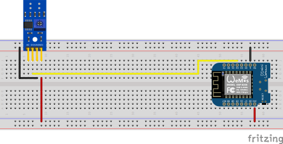
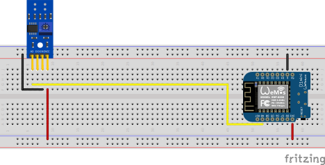
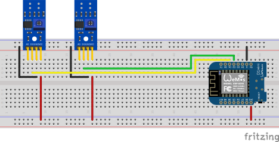
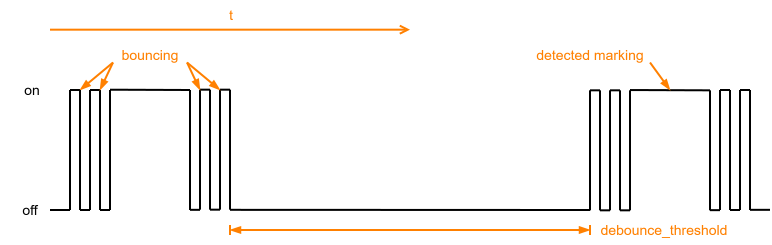
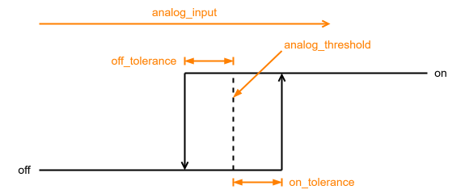

.. _usage-examples:

===================
Anwendungsbeispiele
===================

In diesem Abschnitt sind verschiedene Anwendungsbeispiele für die Ferraris-Plattform beschrieben.

.. _energy-meter-digital:

Auslesen des Stromzählers über den digitalen Ausgang des Infrarotsensors
========================================================================

In dieser Variante wird der digitale Ausgang des Infrarotsensors verwendet, um Umdrehungen der Drehscheibe zu erkennen. Der analoge Ausgang wird nicht benötigt, die anderen Pins müssen mit den entsprechenden Pins des Mikrocontrollers verbunden werden. Für VCC sollte der 3,3V-Ausgang des ESPs verwendet werden und der digitale Ausgang D0 muss mit einem freien GPIO-Pin (z.B. GPIO4, entspricht dem Pin D2 auf dem D1 Mini) verbunden werden.

Der folgende Steckplatinen-Schaltplan zeigt ein Beispiel für einen Versuchsaufbau mit einem ESP8266 D1 Mini Entwicklungsboard als Mikrocontroller.

|

Die Kalibrierung des digitalen Ausgangssignals erfolgt mithilfe des auf der Platine des Infrarotsensors befindlichen Potentiometers, siehe Abschnitt :ref:`Kalibrierung des digitalen Ausgangssignals <digital-calibration>` für Details.

.. hint::

    Sollte es nicht gelingen, eine passende und funktionierende Einstellung für das Potentiometer zu finden, kann alternativ der analoge Ausgang des Infrarotsensors verwendet werden, siehe nächsten Abschnitt.

Software-seitig muss für die Ferraris-Komponente in der YAML-Konfigurationsdatei der Pin konfiguriert werden, der mit dem digitalen Ausgang des TCRT5000-Moduls verbunden ist:

.. code-block:: yaml

    ferraris:
      id: ferraris_meter
      digital_input: GPIO4
      # ...

**Beispiel-Konfiguration:** `ferraris_meter_digital.yaml <https://github.com/jensrossbach/esphome-ferraris-meter/blob/main/example_config/ferraris_meter_digital.yaml>`_

.. _energy-meter-analog:

Auslesen des Stromzählers über den analogen Ausgang des Infrarotsensors
=======================================================================

In dieser Variante wird der analoge Ausgang des Infrarotsensors verwendet, um Umdrehungen der Drehscheibe zu erkennen. Der digitale Ausgang wird nicht benötigt, die anderen Pins müssen mit den entsprechenden Pins des Mikrocontrollers verbunden werden. Für VCC sollte der 3,3V-Ausgang des ESPs verwendet werden und der analoge Ausgang A0 muss mit einem freien ADC-Pin (z.B. GPIO17, entspricht dem Pin A0 auf dem D1 Mini) verbunden werden.

Der folgende Steckplatinen-Schaltplan zeigt ein Beispiel für einen Versuchsaufbau mit einem ESP8266 D1 Mini Entwicklungsboard als Mikrocontroller.

|

Eine Kalibrierung mittels des Potientiometers auf dem TCRT5000-Modul entfällt. Stattdessen müssen software-seitig der Schwellwert für den analogen Eingang und optional die Versatzwerte für eine Hysterese-Kennlinie konfiguriert werden, siehe Abschnitt :ref:`Kalibrierung des analogen Ausgangssignals <analog-calibration>` für Details.

Software-seitig müssen nun beispielsweise folgende Konfigurations-Schritte durchgeführt werden:

In der YAML-Konfigurationsdatei wird ein `ADC-Sensor <https://www.esphome.io/components/sensor/adc.html>`_ konfiguriert, der den mit dem analogen Ausgang des TCRT5000-Moduls verbundenen ADC-Pin ausliest.

.. code-block:: yaml

    sensor:
      - platform: adc
        id: adc_input
        pin: GPIO17
        internal: true
        raw: true
        samples: 10
        update_interval: 50ms

Unter der Konfiguration der Ferraris-Komponente verweist der Eintrag ``analog_input`` auf den angelegten ADC-Sensor und der Eintrag ``analog_threshold`` gibt den analogen Schwellwert an (siehe Abschnitt :ref:`Kalibrierung des analogen Ausgangssignals <analog-calibration>` für weitere Informationen zum analogen Schwellwert). Zudem können optional die Versatzwerte ``off_tolerance`` und ``on_tolerance`` konfiguriert werden (siehe Abschnitt :ref:`Hysterese-Kennlinie <hysteresis-curve>` für weitere Details).

.. code-block:: yaml

    ferraris:
      id: ferraris_meter
      analog_input: adc_input
      analog_threshold: 45.0
      off_tolerance: 1.0
      on_tolerance: 1.0
      # ...

**Beispiel-Konfiguration:** `ferraris_meter_analog.yaml <https://github.com/jensrossbach/esphome-ferraris-meter/blob/main/example_config/ferraris_meter_analog.yaml>`_

.. _energy-meter-multiple:

Auslesen mehrerer Stromzähler
=============================

Es ist auch möglich, mehr als einen Ferraris-Stromzähler mit einem einzigen ESP-Mikrocontroller auszulesen. Dazu benötigt man weitere Infrarotsensoren / TCRT5000-Module und zusätzliche freie GPIO-Pins am Mikrocontroller. Die TCRT5000-Module werden wie schon vorher beschrieben über VCC und GND an die Spannungsquelle des ESP-Mikrocontrollers angeschlossen und die D0-Ausgänge werden jeweils mit einem freien GPIO-Pin an dem ESP-Board verbunden.

.. note::

    Theoretisch kann auch die Variante mit dem analogen Ausgang des Infrarotsensors verwendet werden, allerdings sind die ADC-fähigen Pins auf den ESP-Mikrocontrollern stärker limitiert als die rein digitalen Pins. Insbesondere der ESP8266, der nur einen einzigen ADC hat, wäre daher ungeeignet, mehrere Infrarotsensoren über deren analoge Ausgänge zu unterstützen.

Der folgende Steckplatinen-Schaltplan zeigt ein Beispiel für einen Versuchsaufbau mit zwei TCRT5000-Modulen, die mit einem ESP8266 D1 Mini verbunden sind.

|

Es ist aber zu bedenken, dass jeder weitere Infrarotsensor die Last auf dem Mikrocontroller erhöht und insbesondere bei sehr hohen Geschwindigkeiten der Drehscheiben die Hardware näher an ihre Grenzen bringt.

Software-seitig müssen nun beispielsweise folgende Konfigurations-Schritte durchgeführt werden:

In der YAML-Konfigurationsdatei müssen mehrere Instanzen der Ferraris-Komponente konfiguriert werden (hier beispielhaft 2 Instanzen).

.. code-block:: yaml

    ferraris:
      - id: ferraris_meter_1
        digital_input: GPIO4
        # ...
      - id: ferraris_meter_2
        digital_input: GPIO5
        # ...

Alle von der Ferraris-Plattform bereitgestellten Sensoren und Komponenten müssen, sofern benötigt, vervielfacht und den entsprechenden Instanzen der Ferraris-Komponente über den Eintrag ``ferraris_id`` zugewiesen werden.

.. code-block:: yaml

    sensor:
      - platform: ferraris
        ferraris_id: ferraris_meter_1
        power_consumption:
          name: Power consumption 1
        energy_meter:
          name: Meter reading 1
      - platform: ferraris
        ferraris_id: ferraris_meter_2
        power_consumption:
          name: Power consumption 2
        energy_meter:
          name: Meter reading 2

    binary_sensor:
      - platform: ferraris
        ferraris_id: ferraris_meter_1
        rotation_indicator:
          name: Rotation indicator 1
      - platform: ferraris
        ferraris_id: ferraris_meter_2
        rotation_indicator:
          name: Rotation indicator 2

    switch:
      - platform: ferraris
        ferraris_id: ferraris_meter_1
        calibration_mode:
          name: Calibration mode 1
      - platform: ferraris
        ferraris_id: ferraris_meter_2
        calibration_mode:
          name: Calibration mode 2

Alle weiteren in der YAML-Konfigurationsdatei definierten Komponenten, die mit den Komponenten, Sensoren, Aktoren und Aktionen der Ferraris-Plattform interagieren, müssen eventuell vervielfacht und/oder angepasst werden.

**Beispiel-Konfiguration:** `ferraris_meter_multi.yaml <https://github.com/jensrossbach/esphome-ferraris-meter/blob/main/example_config/ferraris_meter_multi.yaml>`_

.. _calibration:

Kalibrierung
============

Während der Positionierung und Ausrichtung des Infrarotsensors sowie der Einstellung des Potentiometers oder des analogen Schwellwerts ist es wenig sinnvoll, die Umdrehungen der Drehscheibe des Ferraris-Stromzählers zu messen und die Verbräuche zu berechnen, da die Zustandsänderungen des Sensors nicht der tatsächlichen Erkennung der Markierung auf der Drehscheibe entsprechen. Deshalb gibt es die Möglichkeit, die Ferraris-Komponente in den Kalibrierungsmodus zu versetzen, indem man den Schalter für den Kalibrierungsmodus (siehe :ref:`Aktoren <actors>`) einschaltet. Solange der Kalibrierungsmodus aktiviert ist, wird keine Berechnung der Verbrauchsdaten durchgeführt und die entsprechenden Sensoren (siehe :ref:`Primäre Sensoren <primary-sensors>`) werden nicht verändert. Stattdessen ist der diagnostische Sensor für die Umdrehungsindikation (siehe :ref:`Diagnostische Sensoren <diagnostic-sensors>`) aktiv und kann zusätzlich verwendet werden, um bei der korrekten Ausrichtung zu unterstützen. Der Sensor befindet sich in dem Zustand ``on`` wenn die Markierung auf der Drehscheibe erkannt wurde und ``off`` wenn keine Markierung erkannt wurde.

Um den Kalibierungsmodus optimal nutzen zu können, müssen die Komponenten ``calibration_mode`` und ``rotation_indicator`` in der YAML-Datei konfiguriert sein:

.. code-block:: yaml

    binary_sensor:
      - platform: ferraris
        rotation_indicator:
          name: Rotation indicator

    switch:
      - platform: ferraris
        calibration_mode:
          name: Calibration mode

.. _digital-calibration:

Kalibrierung des digitalen Ausgangssignals
------------------------------------------

Mithilfe eines Schraubenziehers kann über das Potientiometer das digitale Ausgangssignal des Infrarotsensors kalibriert werden. Dabei helfen die beiden grünen LEDs auf der Rückseite des Sensors. Die rechte LED leuchtet dauerhaft, wenn der Sensor mit Strom versorgt wird. Die linke LED leuchtet, solange kein "Hindernis" erkannt wurde und erlischt, wenn die Reflektion unterbrochen wurde. Letzteres ist der Zustand, wenn die Markierung auf der Drehscheibe des Ferraris-Stromzählers vor den Sensor wandert. Das Potentiometer sollte also so eingestellt werden, dass die linke LED gerade noch leuchtet, wenn die Markierung nicht im Bereich des Infrarot Sender/Empfänger-Paares ist und erlischt, sobald sich die Markierung davor schiebt. Dies ist nur ein sehr kleiner Bereich und es kann etwas schwierig werden, diese Einstellung zu finden.

.. _analog-calibration:

Kalibrierung des analogen Ausgangssignals
-----------------------------------------

Das analoge Ausgangssignal des Infrarotsensors wird software-seitig je nach Präferenz entweder manuell oder automatisch kalibriert. Der Schwellwert ``analog_threshold`` steuert, wann das analoge Signal als "erkannt" (markierter Bereich der Drehscheibe) und wann als "nicht erkannt" (nicht markierter Bereich der Drehscheibe) behandelt wird. Ist der Wert des ADC-Sensors ``analog_input`` größer als der Schwellwert, gilt die Markierung als erkannt, ist er kleiner oder gleich, gilt sie als nicht erkannt.

.. image:: ../_static/images/analog_threshold.svg
   :alt: Analoger Schwellwert
   :class: dark-light
   :align: center

|

Für die manuelle Kalibrierung muss ein passender Wert für den analogen Schwellwert ermittelt und konfiguriert werden.

Wenn der Schwellwert ermittelt wurde und nicht mehr konfiguriert/verändert werden muss, kann ein fester Zahlenwert für ``analog_threshold`` angegeben werden:

.. code-block:: yaml

    ferraris:
      # ...
      analog_threshold: 45.0
      # ...

Wenn der Schwellwert noch nicht bekannt ist oder später über das User-Interface veränderbar sein soll, kann anstelle eines festen Zahlenwerts eine `Template-Zahlen-Komponente <https://www.esphome.io/components/number/template.html>`_ (oder alternativ eine `Home Assistant Zahlen-Komponente <https://www.esphome.io/components/number/homeassistant.html>`_) eingetragen werden:

.. code-block:: yaml

    ferraris:
      # ...
      analog_threshold: adc_threshold
      # ...

    number:
      - platform: template
        id: adc_threshold
        name: ADC threshold
        icon: mdi:speedometer-slow
        entity_category: config
        mode: box
        optimistic: true
        initial_value: 50.0
        min_value: 0.0
        max_value: 1000.0
        step: 0.5

Es ist auch möglich, den analogen Schwellwert automatisch von der Ferraris-Software berechnen zu lassen. Dies geschieht durch das Aufrufen der Aktion ``start_analog_calibration`` (siehe :ref:`Aktionen <actions>`). Dabei analysiert die Software eine konfigurierbare Anzahl analoger Samples vom Infrarotsensor und ermittelt den kleinsten und den größten analogen Wert. Anschließend wird das arithmetische Mittel aus den beiden Grenzwerten berechnet und als analoger Schwellwert verwendet.

Um den Status und das Ergebnis der automatischen analogen Kalibrierung zu überwachen, können zusätzliche diagnostische Sensoren konfiguriert werden. Diese zeigen an, ob die Kalibrierung gerade läuft, ob sie erfolgreich abgeschlossen wurde und wie hoch die ermittelte Bandbreite der analogen Werte ist.

.. code-block:: yaml

    sensor:
      - platform: ferraris
        # ...
        analog_value_spectrum:
          name: Analoge value spectrum

    binary_sensor:
      - platform: ferraris
        # ...
        analog_calibration_state:
          name: Analog calibration state
        analog_calibration_result:
          name: Analog calibration result

Um die automatische Kalibrierung vom User-Interface aus starten zu können, kann ein `Template-Button <https://www.esphome.io/components/button/template.html>`_ konfiguriert werden, der beim Drücken die Aktion aufruft:

.. code-block:: yaml

    button:
      - platform: template
        name: Start auto calibration
        icon: mdi:auto-fix
        entity_category: diagnostic
        on_press:
          - ferraris.start_analog_calibration:
              id: ferraris_meter
              num_captured_values: 6000
              min_level_distance: 6.0
              max_iterations: 3

Um die automatische Kalibrierung bei jedem Aufstarten des Mikrocontrollers zu starten, kann folgender Eintrag zur Konfiguration der Ferraris-Komponente hinzugefügt werden:

.. code-block:: yaml

    ferraris:
      # ...
      calibrate_on_boot:
        num_captured_values: 6000
        min_level_distance: 6.0
        max_iterations: 3
      # ...

Eine weitere Möglichkeit ist, die Kalibrierung über eine Automation in Home Assistant in regelmäßigen Intervallen oder unter bestimmten Bedingungen zu starten. Dafür führt man beispielsweise folgende Konfigurations-Schritte durch:

In der YAML-Konfigurationsdatei wird die Aktion für die Kalibrierung über die API für Home Assistant zugänglich gemacht.

.. code-block:: yaml

    api:
      # ...
      actions:
        - action: start_analog_calibration
          variables:
            num_captured_values: int
            min_level_distance: float
            max_iterations: int
          then:
            - ferraris.start_analog_calibration:
                id: ferraris_meter
                num_captured_values: !lambda "return num_captured_values;"
                min_level_distance: !lambda "return min_level_distance;"
                max_iterations: !lambda "return max_iterations;"

In Home Assistant wird eine `Automation <https://www.home-assistant.io/docs/automation>`_ erstellt, die die benutzerdefinierte ESPHome-Aktion aufruft (im folgenden Beispiel wird die Kalibrierung gestartet, sobald seit mehr als einer Stunde keine Aktualisierung mehr vom Sensor übertragen wurde).

.. code-block:: yaml

    - id: '1234567890'
      alias: Re-calibrate electricity meter
      triggers:
          trigger: template
          value_template: '{{ now() - states.sensor.ferraris_meter_power_consumption.last_updated >= timedelta(hours=1) }}'
      conditions: []
      actions:
        - action: esphome.ferraris_meter_start_analog_calibration
          data:
            num_captured_values: 6000
            min_level_distance: 6.0
            max_iterations: 3
      mode: single

Alternativ kann in der Automation auch einfach ein Button-Druck des oben beschriebenen Buttons ausgelöst werden, sofern dieser konfiguriert wurde und ein Setzen der Kalibrierungsparameter von Home Assistant aus nicht nötig ist. In diesem Fall kann das Anlegen der Aktion entfallen.

Entprellung
===========

Der Übergang von nicht markiertem zu markiertem Bereich und umgekehrt auf der Drehscheibe kann zu einem schnellen Hin-und Herspringen ("Prellen") des Erkennungszustands des Sensors führen, das vor allem bei langsamen Drehgeschwindigkeiten auftritt und nicht vollständig durch die Kalibrierung unterdrückt werden kann. Dieses Prellen führt zu verfälschten Messwerten und um diese zu vermeiden, gibt es folgende Einstellungensmöglichkeiten.

.. _debounce-threshold:

Entprellungsschwellwert
-----------------------

Der Entprellungsschwellwert ``debounce_threshold`` spezifiziert die minimale Zeit in Millisekunden zwischen fallender und darauffolgender steigender Flanke. Nur wenn die gemessene Zeit zwischen den zwei Flanken über dem konfigurierten Wert liegt, wird die Sensorauslösung berücksichtigt. Diese Art der Entprellung funktioniert bei der Verwendung sowohl des digitalen als auch des analogen Eingangssignals des Infrarotsensors.

|

Um eine Entprellung über den Schwellwert zu aktivieren, muss der entsprechende Wert in der Konfiguration der Ferraris-Komponente gesetzt werden:

.. code-block:: yaml

    ferraris:
      # ...
      debounce_threshold: 400
      # ...

Wenn der Wert dynamisch über das User-Interface einstellbar sein soll, kann anstelle eines festen Zahlenwerts eine `Template-Zahlen-Komponente <https://www.esphome.io/components/number/template.html>`_ (oder alternativ eine `Home Assistant Zahlen-Komponente <https://www.esphome.io/components/number/homeassistant.html>`_) eingetragen werden:

.. code-block:: yaml

    ferraris:
      # ...
      debounce_threshold: debounce_threshold
      # ...

    number:
      - platform: template
        id: debounce_threshold
        name: Debounce threshold
        icon: mdi:speedometer-slow
        entity_category: config
        mode: box
        optimistic: true
        initial_value: 400
        min_value: 0
        max_value: 2000
        step: 1

.. _hysteresis-curve:

Hysterese-Kennlinie
-------------------

Die beiden Versatzwerte ``off_tolerance`` (Ausschalttoleranz) und ``on_tolerance`` (Einschalttoleranz) können konfiguriert werden, um eine Hysterese-Kennlinie für die Erkennung des markiertes Bereichs auf der Drehscheibe über das analoge Signal zu verwenden. Dadurch wird ein "Zittern" des analogen Signals kompensiert und damit ein mögliches Prellen des Erkennungszustands für den markierten Bereich auf der Drehscheibe minimiert. Diese Art der Entprellung funktioniert nur bei der Verwendung des analogen Eingangssignals des Infrarotsensors.

|

Um eine Entprellung über die Hysterese-Kennlinie zu aktivieren, müssen die entsprechenden Werte in der Konfiguration der Ferraris-Komponente gesetzt werden:

.. code-block:: yaml

    ferraris:
      # ...
      off_tolerance: 1.0
      on_tolerance: 1.0
      # ...

Wenn die Werte dynamisch über das User-Interface einstellbar sein sollen, können anstelle der festen Zahlenwerte `Template-Zahlen-Komponenten <https://www.esphome.io/components/number/template.html>`_ (oder alternativ `Home Assistant Zahlen-Komponenten <https://www.esphome.io/components/number/homeassistant.html>`_) eingetragen werden:

.. code-block:: yaml

    ferraris:
      # ...
      off_tolerance: off_tolerance
      on_tolerance: on_tolerance
      # ...

    number:
      - platform: template
        id: off_tolerance
        name: Hysteresis switch-off tolerance
        icon: mdi:speedometer-slow
        entity_category: config
        mode: slider
        optimistic: true
        initial_value: 1.0
        min_value: 0.0
        max_value: 5.0
        step: 0.5
      - platform: template
        id: on_tolerance
        name: Hysteresis switch-on tolerance
        icon: mdi:speedometer-slow
        entity_category: config
        mode: slider
        optimistic: true
        initial_value: 1.0
        min_value: 0.0
        max_value: 5.0
        step: 0.5

Glättung des analogen Signals
-----------------------------

Durch eine geschickte Konfiguration des Aktualisierungsintervalls ``update_interval`` und der Anzahl Abtastungen pro Aktualisierung (``samples``) für den analogen Sensor ``analog_input`` kann die Kurve des analogen Signals so weit geglättet werden, dass kurzfristige Schwankungen eliminiert werden. Es ist aber zu bedenken, dass zu große Aktualisierungsintervalle dazu führen können, dass einzelne Umdrehungen bei sehr hohen Drehgeschwindigkeiten nicht mehr erkannt werden, da dann die Zeit zwischen steigender und darauffolgender fallender Flanke kleiner als das eingestellte Aktualisierungsintervall ist. Auch diese Art der Entprellung funktioniert nur bei der Verwendung des analogen Eingangssignals des Infrarotsensors.

Manuelles Überschreiben des Zählerstands
========================================

Um den Zählerstand in der Ferraris-Komponente mit dem tatsächlichen Zählerstand des Ferraris-Stromzählers abzugleichen, kann der Wert des Verbrauchszähler-Sensors explizit überschrieben werden. Dazu werden die zwei Aktionen ``ferraris.set_energy_meter`` und ``ferraris.set_rotation_counter`` (siehe :ref:`Aktionen <actions>`) zur Verfügung gestellt.

.. hint::

   Normalerweise ist nur eine der beiden Aktionen nötig, je nachdem, ob man den Zählerstand in Kilowattstunden oder lieber in Anzahl Umdrehungen setzen möchte.

Abhängig davon, ob das Setzen des Zählerstands händisch über das User-Interface oder automatisiert über Automationen und Skripte erfolgen soll, können die Aktionen auf unterschiedliche Weise verwendet werden. Nachfolgend sind zwei mögliche Anwendungsbeispiele beschrieben, es gibt aber noch weitere, hier nicht beschriebene Möglichkeiten.

Händisches Setzen des Zählerstands über das User-Interface
==========================================================

Dafür führt man beispielsweise folgende Konfigurations-Schritte durch (in diesem Beispiel zum Setzen des Zählerstands als Kilowattstunden-Wert):

In der YAML-Konfigurationsdatei wird eine `Template-Zahlen-Komponente <https://www.esphome.io/components/number/template.html>`_ angelegt und für einen Zählerstand in der Einheit Kilowattstunden konfiguriert.

.. code-block:: yaml

    number:
      - platform: template
        id: target_energy_value
        name: Manual meter reading
        icon: mdi:counter
        unit_of_measurement: kWh
        device_class: energy
        entity_category: config
        mode: box
        optimistic: true
        min_value: 0
        max_value: 1000000
        step: 0.01

In der YAML-Konfigurationsdatei wird ein `Template-Button <https://www.esphome.io/components/button/template.html>`_ angelegt und so konfiguriert, dass beim Drücken die Aktion zum Setzen des Zählerstands ausgeführt wird. Der zu übergebende Zielwert wird dabei aus der angelegten Zahlen-Komponente gelesen.

.. code-block:: yaml

    button:
      - platform: template
        name: Overwrite meter reading
        icon: mdi:download
        entity_category: config
        on_press:
          - ferraris.set_energy_meter:
              id: ferraris_meter
              value: !lambda |-
                float val = id(target_energy_value).state;
                return (val >= 0) ? val : 0;

Automatisiertes Setzen des Zählerstands
=======================================

Dafür führt man beispielsweise folgende Konfigurations-Schritte durch:

In der YAML-Konfigurationsdatei wird eine `benutzerdefinierte Aktion <https://www.esphome.io/components/api.html#api-device-actions>`_ angelegt, die eine der Ferraris-Aktionen (im folgenden Beispiel die Aktion ``ferraris.set_energy_meter``) aufruft.

.. code-block:: yaml

    api:
      # ...
      actions:
        - action: set_energy_meter
          variables:
            target_value: float
          then:
            - ferraris.set_energy_meter:
                id: ferraris_meter
                value: !lambda |-
                  return (target_value >= 0)
                            ? target_value
                            : 0;

In Home Assistant wird eine `Automation <https://www.home-assistant.io/docs/automation>`_ erstellt, die die benutzerdefinierte ESPHome-Aktion aufruft (im folgenden Beispiel wird der Zählerstand am Anfang eines jeden Monats zurückgesetzt).

.. code-block:: yaml

    - id: '1234567890'
      alias: Reset energy meter reading
      trigger:
        - platform: time
          at: 00:00:00
      condition:
        - condition: template
          value_template: '{{ now().day == 1 }}'
      action:
        - action: esphome.ferraris_meter_set_energy_meter
          data:
            target_value: 0
      mode: single

Wiederherstellung des Zählerstands nach einem Neustart
======================================================

Um die Lebensdauer des Flash-Speichers auf dem ESP-Mikrocontroller nicht zu verringern, speichert die Ferraris-Komponente keine Daten persistent im Flash. Dadurch kann sie sich zunächst einmal den Zählerstand über einen Neustart des Mikrocontrollers hinweg nicht merken und der Zähler beginnt bei jedem Boot-Vorgang bei 0 kWh zu zählen. Somit müsste man nach jedem Neustart den Zählerstand manuell durch einen am Ferraris-Stromzähler abgelesenen Wert überschreiben. Da dies nicht sehr benutzerfreundlich ist, gibt es die Möglichkeit, den letzten Zählerstand in Home Assistant zu persistieren und beim Booten des Mikrocontrollers an diesen zu übertragen.

Damit dies funktioniert, müssen beispielsweise folgende Konfigurations-Schritte durchgeführt werden:

In Home Assistant wird ein `Zahlenwert-Eingabehelfer <https://www.home-assistant.io/integrations/input_number>`_ angelegt (in diesem Beispiel mit der Entitäts-ID ``input_number.electricity_meter_last_value``). Anschließend wird in der YAML-Konfigurationsdatei eine `Home Assistant Zahlen-Komponente <https://www.esphome.io/components/number/homeassistant.html>`_ angelegt, die den angelegten Zahlenwert-Eingabehelfer importiert.

.. code-block:: yaml

    number:
      - platform: homeassistant
        id: last_energy_value
        entity_id: input_number.electricity_meter_last_value

Unter der Konfiguration der Ferraris-Komponente verweist der Eintrag ``energy_start_value`` auf die angelegte Zahlen-Komponente.

.. code-block:: yaml

    ferraris:
      # ...
      energy_start_value: last_energy_value

In Home Assistant wird eine `Automation <https://www.home-assistant.io/docs/automation/basics>`_ erstellt, die bei Änderung des Verbrauchszähler-Sensors den aktuellen Sensorwert in den angelegten Zahlenwert-Eingabehelfer kopiert.

.. code-block:: yaml

    - id: '1234567890'
      alias: Update meter reading cache
      trigger:
      - platform: state
        entity_id:
          - sensor.ferraris_meter_energy
      condition: []
      action:
      - action: input_number.set_value
        target:
          entity_id: input_number.electricity_meter_last_value
        data:
          value: '{{ states(trigger.entity_id) }}'
      mode: single

Alternativ kann auch eine `Sensor-Automation <https://www.esphome.io/components/sensor/#sensor-automation>`_ für den Sensor ``energy_meter`` in der YAML-Konfigurationsdatei angelegt werden, die die angelegte Zahlen-Komponente direkt von ESPHome aus aktualisiert. Allerdings verlängert dies die Verarbeitungszeit pro Umdrehung im Mikrocontroller und kann u.U. dazu führen, dass bei sehr hohen Stromverbräuchen (und damit sehr hohen Drehgeschwindigkeiten) einzelne Umläufe der Drehscheibe nicht erfasst werden. Daher empfehle ich die Variante mit der Automation in Home Assistant.
