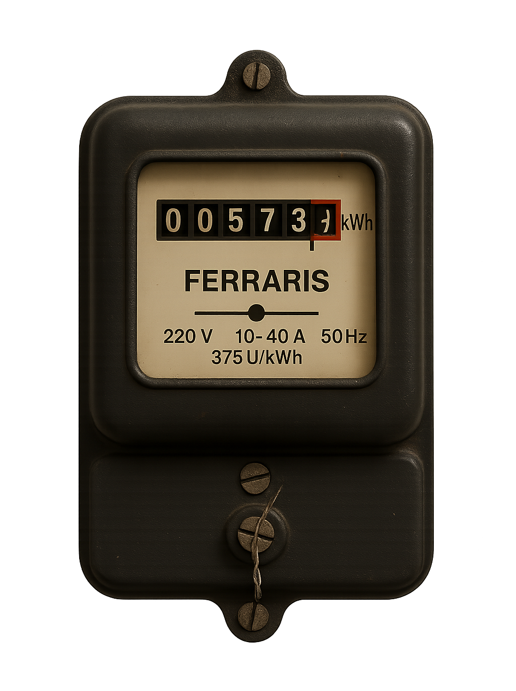

======================
ESPHome Ferraris Meter
======================

Ferraris Meter ist eine ESPHome-Plattform zur Erstellung einer ESP-Firmware, die mithilfe eines ESP-Mikrocontrollers und eines Infrarotsensors die Geschwindigkeit und die Umdrehungen der Drehscheibe eines analogen Ferraris-Stromzählers ermitteln und daraus den momentanen Stromverbrauch und den Zählerstand berechnen kann. Diese Werte können dann zur weiteren Verarbeitung an eine Hausautomatisierungs-Software wie beispielsweise Home Assistant geschickt werden.

Hauftungsausschluss
===================
**DIE SOFTWARE (EINSCHLIEßLICH DER DOKUMENTATION MIT HARDWARE BEISPIEL-AUFBAUTEN) WIRD OHNE MÄNGELGEWÄHR UND OHNE JEGLICHE AUSDRÜCKLICHE ODER STILLSCHWEIGENDE GEWÄHRLEISTUNG, EINSCHLIEẞLICH, ABER NICHT BESCHRÄNKT AUF DIE GEWÄHRLEISTUNG DER MARKTGÄNGIGKEIT, DER EIGNUNG FÜR EINEN BESTIMMTEN ZWECK UND DER NICHTVERLETZUNG VON RECHTEN DRITTER, ZUR VERFÜGUNG GESTELLT. DIE AUTOREN ODER URHEBERRECHTSINHABER SIND IN KEINEM FALL HAFTBAR FÜR ANSPRÜCHE, SCHÄDEN ODER ANDERE VERPFLICHTUNGEN, OB IN EINER VERTRAGS- ODER HAFTUNGSKLAGE, EINER UNERLAUBTEN HANDLUNG ODER ANDERWEITIG, DIE SICH AUS ODER IN VERBINDUNG MIT DER SOFTWARE ODER DER NUTZUNG ODER ANDEREN GESCHÄFTEN MIT DER SOFTWARE ERGEBEN.**

.. toctree::
   :hidden:

   documentation/index
